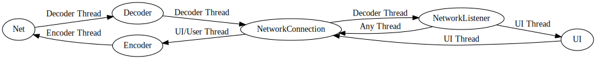

# Anker

Simple chat app for two clients built with JavaFX.

## Running

Use `gradle run` to run the app.

### IntelliJ

From the `Gradle` sidebar, right-click the `anker > Tasks > application > run` task
and select `Modify Run Configuration...`.

Image

In the dialog, add `Allow multiple instances` in the `Add options` menu and click ok.

Image

Now run the gradle task two times to get two instances by clicking two times on the ▶ button (`SHIFT` + `F10`).

# Architecture

# Network Protocol

This protocol is used by entities (clients and servers) to communicate game state and progress.
Currently, TCP connections are used to transmit messages, though messages may be exchanged over any bidirectional,
lossless, and ordered connection.

## Frame Format

The frame format is designed to be easily en-/decoded.

A data frame consists of a hash, length and payload:

<!-- prettier-ignore-start -->

| Part           | Length in bytes    | Description                                                                                                                                                       |
|----------------|--------------------|-------------------------------------------------------------------------------------------------------------------------------------------------------------------|
| Payload flags  | 1                  | Currently unused (`0`), may include flags for the payload content/encoding/compression in the future                                                              |
| Payload length | 3                  | Unsigned 24bit integer length of the payload. Clients and servers may set a limit for the payload length and close connections if the length is above this limit. |
| Payload hash   | 32                 | A SHA-256 hash of the payload data (in its transmitted representation, i.e encoded/compressed).                                                                   |
| Payload        | `<payload-length>` | A valid UTF-8 encoded JSON payload (as described in [Payloads](#payloads)).                                                                                       |

<!-- prettier-ignore-end -->

A frame is at least `36` bytes long.

### Error Handling

#### Invalid Payload Flags

If an entity receives a frame with invalid flags, it **must** check the payload hash.
If the payload hash is invalid (as described in [Invalid Payload Hash](#invalid-payload-hash)), it **must** close the
connection immediately, otherwise it **must** discard the frame.

#### Too Large Payload

If an entity receives a frame which has a length that exceeds its limit for payloads, it **must** close the connection
immediately.

#### Invalid Payload Hash

If the result of `sha256(payload)` results in a different hash than the hash provided,
the entity **must** immediately close the connection.

#### Invalid Payload

If an entity encounters an invalid payload (such as invalid JSON),
it **must** discard the frame.

## Payloads

TODO: list types, add examples

## Clients and Servers

The protocol itself isn't concerned about an entity's role (server/client).

A server may act as a matchmaker/proxy connecting two clients.
This functionality is, as far as the protocol is concerned, opaque to clients.
